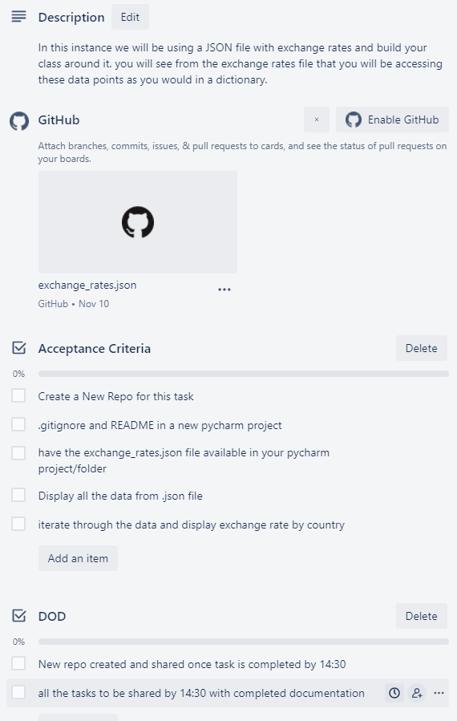

# Task


**Explanation**
- Here we want to be able to read from a ```.json``` file and pinpoint values we want

- We need to import the ```json``` module to be able to import json files and turn them into dictionaries

- This is the first iteration where all it does is written in the acceptance criteria above

- To turn a ```.json``` file into a dictionary we use the ```with open``` keywords as shown in the code below

- The required exchange rates are given as a dictionary so we must iterate through their keys (the country's currency name) and their values (the exchange rate)

```python
import json

class Currency:
    def __init__(self):
        self.exchange_rates = self.create_dic()
        self.display_all_data()
        input("\nPress enter to show the rates")
        self.display_rates()

    # This opens the required json file and stores it as an attribute
    # By default, we are returned a dictionary    
    def create_dic(self):
        with open("exchange_rate.json", "r") as er:
            dic = json.load(er)
        return dic

    # Iterates through the json file and outputs the key, val pairs
    def display_all_data(self):
        for key, value in self.exchange_rates.items():
            print(f"{key} : {value}")

    # Iterates through the rates dictionary and shows rate by country
    def display_rates(self):
        for key, value in self.exchange_rates["rates"].items():
            print(f"{key} : {value}")  

Currency() 
```

<br>

---
- We can add extra functionality to ask whether they want to convert currency:

    ```python
        # Converts currency1 to currency2
    def convert(self, c1, c2):
        currency1 = self.exchange_rates["rates"][c1]
        currency2 = self.exchange_rates["rates"][c2]
        print(f"1 {c1} = {currency2/currency1} {c2}")

    # Asks input from user and returns the current exchange rate
    def exchange_menu(self):
        print(self.currency)
        while True:
            c_from = input("\nInput a currency to exchange from:  ").upper()
            if not self.check_if_valid(c_from):
                continue
            c_to = input("Input a currency to exchange to:  ").upper()
            if not self.check_if_valid(c_to):
                continue
            self.convert(c_from, c_to)
            choice = input("\nDo you want to exchange again? (Y/N) \n--> ").upper().strip()
            if choice == "Y":
                continue
            if choice == "N":
                break
            else:
                print("Unknown command, please input Y or N only")
                print("Exchanging again...")
                continue

    # Checks if the currency is supported
    def check_if_valid(self, value):
        if value not in self.currency:
            return False
        return True
    ```